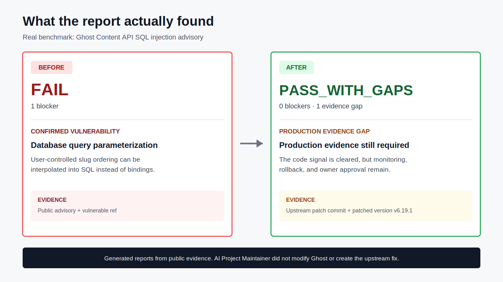

# AI Project Maintainer


[](https://www.npmjs.com/package/ai-project-maintainer)
[](https://github.com/xixifusi1213-gif/ai-project-maintainer/actions/workflows/ci.yml)
[](https://github.com/xixifusi1213-gif/ai-project-maintainer/actions/workflows/security.yml)

**Release readiness and production accident gate for AI-coded projects.**

Run one command to see what blocks release, what is only an untriaged scanner signal, what evidence is missing, and what still needs a human decision.

```powershell
npx ai-project-maintainer quickstart .
```

No account or project setup is required. Quickstart is report-only and writes under `reports/`.

[See the demo](docs/DEMO.md) | [Chinese demo](docs/DEMO.zh-CN.md) | [Real project smoke](docs/REAL-PROJECT-SMOKE.md) | [Production gate smoke](docs/PRODUCTION-GATE-SMOKE.md) | [Benchmark](docs/BENCHMARK.md) | [Real OSS cases](docs/CASE-STUDIES.md) | [Project profiles](docs/PROJECT-PROFILES.md) | [AI agent risk checks](docs/AGENT-RISK.md) | [Why trust this?](TRUST.md)

## 30-Second Quickstart

Requires Node.js 20+.

```powershell
npx ai-project-maintainer quickstart .
```

It detects the project profile, runs a lightweight gate, and creates:

- `reports/quickstart-summary.md`
- `reports/quickstart-security-report.json`
- `reports/quickstart-repair-pack/` when blockers exist

Give the summary, detailed report, and repair pack to Cursor, Claude Code, Cline, or Codex. Quickstart skips project tests and production evidence by default so the first run stays low-cost.

## A Real Before / After Report



This image is rendered from the committed [before report](docs/benchmark-output/ghost-sql-injection/before-security-report.json) and [after report](docs/benchmark-output/ghost-sql-injection/after-security-report.json). It models a public Ghost advisory and upstream patched version. AI Project Maintainer did not modify Ghost, ship exploit code, or create the upstream fix.

## Read the Result in 20 Seconds

| Status | Meaning |
| --- | --- |
| `FAIL` | At least one release blocker exists. It is not automatically a confirmed vulnerability. |
| `PASS_WITH_GAPS` | No blocker failed, but evidence or owner decisions are still missing. |
| `PASS_WITH_WARNINGS` | No blockers or evidence gaps; non-blocking warnings remain. |
| `PASS` | No blockers, warnings, gaps, or pending decisions in the checks that ran. |

Every non-passing item also has a `findingKind`:

| Finding kind | What it means |
| --- | --- |
| `confirmed_vulnerability` | Explicitly validated vulnerability evidence; never inferred from scanner output alone. |
| `untriaged_scanner_finding` | A scanner matched something that still needs project-specific validation. |
| `verified_check_failure` | A deterministic test, build, or engineering check failed. |
| `production_evidence_gap` | Required proof is missing; this is not a discovered vulnerability. |
| `maintainer_decision` | Business context or risk acceptance must come from a human. |
| `environment_tooling_issue` | A tool, database, dependency, or network step was unavailable. |

## Full Production Gate

Use the stricter path when the project is close to release:

```powershell
npx ai-project-maintainer init-audit . --wizard
npx ai-project-maintainer gate . --profile auto --production --agent-risk --strict --release --output reports/security-report.json
npx ai-project-maintainer repair-pack reports/security-report.json --project . --output reports
```

The full gate runs project tests, release/build checks, security tools, and production evidence checks. It can block missing data boundaries, authorization tests, idempotency/replay evidence, migration safety, monitoring, rollback, and owner approval.

## Release Trust

Releases use GitHub Actions, npm Trusted Publishing/provenance, SBOMs, release manifests, and published-package verification. See [Release trust](docs/RELEASE-TRUST.md), [Report schema](docs/REPORT-SCHEMA.md), and [Security policy](SECURITY.md).

## Public Benchmark

The reproducible benchmark uses real public incidents as evidence models:

| Category | Case | Evidence type | Before | After |
| --- | --- | --- | --- | --- |
| Electron desktop | SiYuan Electron RCE | advisory + patched release + hardening model | FAIL | PASS_WITH_GAPS |
| Database | Ghost SQL injection | advisory + patch commit + patched version | FAIL | PASS_WITH_GAPS |
| Web/API | Next.js middleware authorization bypass | advisory + patched version | FAIL | PASS_WITH_GAPS |
| CI / supply chain | tj-actions/changed-files compromise | advisory + CISA alert + hardening model | FAIL | PASS_WITH_GAPS |
| OSS npm library | TanStack npm package compromise | postmortem + release workflow hardening model | FAIL | PASS_WITH_GAPS |

Run `npm run benchmark:verify`, or inspect the [benchmark summary](docs/benchmark-output/benchmark-summary.md), [Real OSS cases](docs/CASE-STUDIES.md), and [production gate smoke](docs/PRODUCTION-GATE-SMOKE.md). The benchmark does not modify upstream projects, vendor source trees, or ship exploit code, and it does not claim upstream fixes were made by this tool.

## What It Checks

| Area | Evidence produced |
| --- | --- |
| Tests and release scripts | test/E2E/build/dist failures |
| Code and dependencies | Gitleaks, package audit, Trivy, OSV-Scanner, Semgrep |
| Supply chain and CI | Syft, Grype, actionlint, zizmor, provenance |
| AI agent risk | MCP permissions, Codex/Claude/Cursor instructions, prompt injection content, dangerous agent-runnable scripts |
| App-specific risks | IaC, Electron, database migration/write safety |
| Production accidents | data exposure, auth boundaries, critical flows, monitoring, rollback, incident response |

## Production Audit, Not Just Scanning

v1.5.0 adds an intake-driven production accident and data-exposure layer:

```text
.ai-maintainer/project-profile.yml
.ai-maintainer/evidence-sources.yml
.ai-maintainer/data-boundaries.yml
.ai-maintainer/authz-matrix.yml
.ai-maintainer/business-flows.yml
.ai-maintainer/risk-policy.yml
.ai-maintainer/intake-summary.md
.ai-maintainer/threat-model.md
.ai-maintainer/release-checklist.yml
.ai-maintainer/incident-runbook.md
.ai-maintainer/db-migration-policy.yml
.ai-maintainer/observability-checklist.yml
```

The new production safety files let the full production gate check:

- data classes, sensitive fields, response/log boundaries, and redaction tests
- roles, protected resources, owner/tenant fields, actions, and object-level authorization tests
- critical business flows with side effects, abuse controls, idempotency, replay safety, and linked tests
- database write safety, audit logs, backup, rollback, and migration review evidence

This is not a production safety guarantee. It prevents missing business/data/security evidence from being mistaken for release readiness.

The guided intake wizard writes these files:

```powershell
npx ai-project-maintainer init-audit "E:\my-project" --wizard
npx ai-project-maintainer init-audit "E:\my-project" --wizard --lang zh-CN
npx ai-project-maintainer init-audit "E:\my-project" --wizard --dry-run
```

The CLI asks deterministic questions and writes YAML. It does not call OpenAI APIs. When used from Codex, the `ai-project-maintainer` skill can explain each question, ask follow-ups, and then let the CLI write the same files.

## Optional Production Evidence Connectors

By default, the tool is account-free and does not call production platforms. v0.7.0 adds optional read-only connectors for projects that want stronger production evidence:

```powershell
npx ai-project-maintainer connectors doctor "E:\my-project"
npx ai-project-maintainer evidence "E:\my-project" --output reports/evidence-report.json
npx ai-project-maintainer gate "E:\my-project" --production --connectors --strict --release --output reports/security-report.json
```

v0.7.0 implements GitHub Environments, Sentry, Vercel, Grafana, Prometheus, Bytebase, Atlas local migration lint, Cloudflare Pages, Render, and Fly. Each connector is opt-in and read-only. Missing tokens or unreadable APIs become `GAP` by default, not hidden success.

Tokens stay in environment variables, never in `.ai-maintainer/connectors.yml`:

```yaml
connectors:
  github:
    enabled: true
    token_env: GITHUB_TOKEN
    owner: your-org
    repo: your-repo
    environment: production
  grafana:
    enabled: true
    token_env: GRAFANA_TOKEN
    base_url: https://grafana.example.com
  atlas:
    enabled: true
    migrations_dir: migrations
    dev_url_env: ATLAS_DEV_URL
```

The connectors only read evidence. They do not deploy, roll back, change environment variables, modify databases, or create alerts. Missing tokens or unavailable APIs become `GAP` by default, unless your risk policy explicitly blocks missing production evidence.

## AI Agent Risk Checks

v0.9.0 adds a local-only gate for the risks created by giving AI agents access to a repository:

```powershell
npx ai-project-maintainer agent-risk "E:\my-project"
npx ai-project-maintainer gate "E:\my-project" --agent-risk --strict --release --output reports/security-report.json
```

It checks MCP config, Codex/Claude/Cursor instructions, prompt-injection-like repository text, sensitive filenames, package lifecycle scripts, and runnable project scripts. It never starts MCP servers, never calls OpenAI/Codex APIs, and never writes token values into reports.

## AI Agent Repair Pack

v1.2.0 converts a gate report into repair tasks that any AI coding assistant can consume. Codex is supported through a compatibility file, but the primary format is generic:

```powershell
npx ai-project-maintainer repair-pack "E:\my-project\reports\security-report.json" --project "E:\my-project" --output "E:\my-project\reports"
```

It writes:

```text
reports/fix-plan.md
reports/agent-tasks.json
reports/codex-tasks.json
reports/recheck-commands.ps1
reports/recheck-commands.sh
```

Tasks are separated into `auto_fix_candidate`, `needs_maintainer_decision`, `manual_review_required`, and `recheck_only`, so an AI agent can fix the right things while leaving business risk acceptance to the maintainer. See [AI repair pack](docs/REPAIR-PACK.md).

The user supplies business facts and evidence locations. The tool decides which checks apply and labels every item clearly:

```text
PASS           checked and OK
FAIL           checked and failed
WARN           risky but not blocking by default
GAP            missing evidence
N/A            not applicable to this project
USER_DECISION  maintainer judgment required
```

By default, `GAP` is reported but does not fail the gate. To make missing production evidence a hard release blocker:

```yaml
production:
  block_on_coverage_gaps: true
```

## Reports

Each run writes:

```text
reports/security-report.json
reports/security-report.md
reports/security-report.sarif
reports/sbom.cdx.json
reports/agent-risk-report.json
reports/agent-risk-report.md
reports/fix-plan.md
reports/agent-tasks.json
reports/codex-tasks.json
reports/recheck-commands.ps1
reports/recheck-commands.sh
```

Reports include:

- PASS/FAIL summary
- `overallStatus`: `FAIL`, `PASS_WITH_GAPS`, `PASS_WITH_WARNINGS`, or `PASS`
- `evidenceLevel`: `TOOL_VERIFIED`, `PLATFORM_VERIFIED`, `USER_REPORTED`, `INFERRED`, or `GAP`
- `standardRefs` and top-level `standards` crosswalk data
- blockers and warnings
- production evidence gaps
- AI agent and MCP risk findings
- user decisions still needed
- tool versions and commands
- exception usage
- SARIF for GitHub Code Scanning
- open source maintenance score

By default, SARIF only uploads actionable code/security findings to GitHub Code Scanning. Non-blocking production gaps stay in the Markdown/JSON report and Actions Summary so the public Security page does not look like a vulnerability wall for missing logs or alerts.

v0.8.0 adds standards-backed trust metadata. The mapping explains which checks are supported by public frameworks such as NIST SSDF, OWASP SAMM, SLSA, OpenSSF Scorecard, Google SRE, CIS Control 11, NIST SP 800-34, and DORA research. It is not a certification or security guarantee.

## Use With Codex

Install as a Codex skill:

```powershell
git clone https://github.com/xixifusi1213-gif/ai-project-maintainer.git
cd .\ai-project-maintainer
Copy-Item -Recurse .\ai-project-maintainer "$env:USERPROFILE\.codex\skills\ai-project-maintainer"
```

Then ask Codex:

```text
$ai-project-maintainer help me run the AI-assisted project intake interview.
$ai-project-maintainer generate a production audit plan for this project, run the production gate, fix blockers, and rerun until it passes.
```

## Source Checkout Commands

If you are using the repository directly instead of npm:

```powershell
node .\ai-project-maintainer\scripts\doctor.mjs
node .\ai-project-maintainer\scripts\init-project.mjs "E:\my-project" --profile auto --ci github
node .\ai-project-maintainer\scripts\init-audit.mjs "E:\my-project" --wizard
node .\ai-project-maintainer\scripts\audit-plan.mjs "E:\my-project" --output reports/audit-plan.json
node .\ai-project-maintainer\scripts\agent-risk.mjs "E:\my-project" --output reports/agent-risk-report.json
node .\ai-project-maintainer\scripts\run-local-gate.mjs "E:\my-project" --production --agent-risk --strict --release --output reports/security-report.json
node .\ai-project-maintainer\scripts\run-local-gate.mjs "E:\my-project" --production --connectors --agent-risk --strict --release --output reports/security-report.json
node .\ai-project-maintainer\scripts\repair-pack.mjs "E:\my-project\reports\security-report.json" --project "E:\my-project" --output "E:\my-project\reports"
node .\ai-project-maintainer\scripts\report-summary.mjs "E:\my-project\reports\security-report.json"
```

## What This Is Not

This tool does not prove absolute security, replace human risk ownership, or eliminate final audits for high-stakes systems.

It is designed for the practical middle ground: a personal developer or small team using AI coding, with enough process to maintain a serious project without manually checking every item from scratch.

## Documentation

- [Demo](docs/DEMO.md)
- [中文演示](docs/DEMO.zh-CN.md)
- [Real OSS case studies](docs/CASE-STUDIES.md)
- [Benchmark](docs/BENCHMARK.md)
- [公开 Benchmark](docs/BENCHMARK.zh-CN.md)
- [Trust model](TRUST.md)
- [Design notes](DESIGN.md)
- [Release trust](docs/RELEASE-TRUST.md)
- [Report schema](docs/REPORT-SCHEMA.md)
- [Security policy](SECURITY.md)
- [AI repair pack](docs/REPAIR-PACK.md)
- [Standards crosswalk](docs/STANDARDS-CROSSWALK.md)
- [Production evidence connectors](docs/CONNECTORS.md)
- [生产证据连接器](docs/CONNECTORS.zh-CN.md)
- [Live connector validation](docs/LIVE-CONNECTOR-VALIDATION.zh-CN.md)
- [Before/after case](docs/demo-output/before-after-case.md)
- [Security workflow](docs/SECURITY-WORKFLOW.md)
- [Production audit workflow](docs/PRODUCTION-AUDIT.zh-CN.md)
- [Intake schema](docs/INTAKE-SCHEMA.zh-CN.md)
- [Install guide](docs/INSTALL.zh-CN.md)
- [GitHub Actions guide](docs/CI-GITHUB-ACTIONS.zh-CN.md)
- [Policy and exceptions](docs/POLICY-AND-EXCEPTIONS.zh-CN.md)
- [Promotion kit](docs/PROMOTION.md)

## Development

```powershell
npm install
npm test
npm run check
npm pack --dry-run
```
