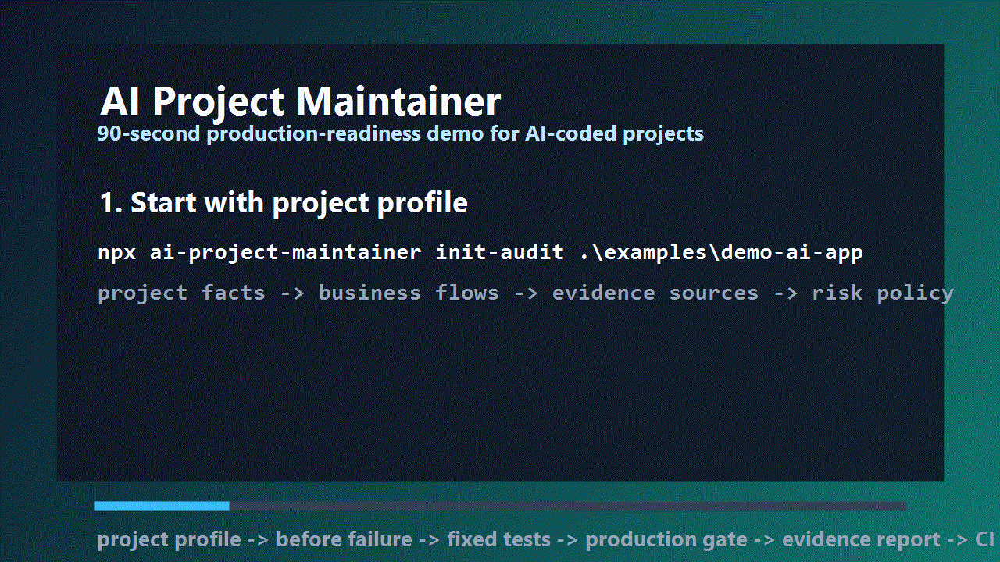

# AI Project Maintainer


[](https://www.npmjs.com/package/ai-project-maintainer)
[](https://github.com/xixifusi1213-gif/ai-project-maintainer/actions/workflows/ci.yml)
[](https://github.com/xixifusi1213-gif/ai-project-maintainer/actions/workflows/security.yml)

**Release readiness gate for AI-coded projects.**

AI can generate code fast. This tool helps you keep the project maintainable after that: collect project evidence, plan the audit, run deterministic gates, generate AI-agent repair tasks, and rerun until the release is defensible.

[See the demo](docs/DEMO.md) | [Chinese demo](docs/DEMO.zh-CN.md) | [Benchmark](docs/BENCHMARK.md) | [Real OSS cases](docs/CASE-STUDIES.md) | [Project profiles](docs/PROJECT-PROFILES.md) | [AI agent risk checks](docs/AGENT-RISK.md) | [AI repair pack](docs/REPAIR-PACK.md) | [Why trust this?](TRUST.md) | [Release trust](docs/RELEASE-TRUST.md) | [Design notes](DESIGN.md) | [Standards crosswalk](docs/STANDARDS-CROSSWALK.md)

It is not another scanner wrapper. It turns AI coding maintenance into a repeatable loop:

```text
project profile -> audit plan -> local/CI gate -> evidence report -> AI fixes -> rerun
```

## Why This Exists

AI coding makes it easy to ship code that looks complete but quietly misses production basics:

- no business-flow tests
- no secret/dependency/security gate
- no database migration review
- no release approval or rollback evidence
- no monitoring/logging/alerting proof
- no clear owner-approved exceptions

`ai-project-maintainer` makes those gaps visible before they become production surprises.

## 30-Second Quickstart

Requires Node.js 20+.

```powershell
npx ai-project-maintainer doctor --no-trivy-db
npx ai-project-maintainer init ".\my-project" --profile auto --ci github
npx ai-project-maintainer agent-risk ".\my-project"
npx ai-project-maintainer init-audit ".\my-project" --wizard --dry-run
npx ai-project-maintainer init-audit ".\my-project" --wizard
npx ai-project-maintainer gate ".\my-project" --profile auto --production --agent-risk --strict --release --output reports/security-report.json
npx ai-project-maintainer repair-pack reports/security-report.json --project ".\my-project" --output reports
```

`PASS_WITH_GAPS` means no blocking checks failed, but release-readiness evidence is still missing or needs owner approval before production.

## The 3-Minute Flow

Requires Node.js 20+.

```powershell
# 1. Add local and CI guardrails
npx ai-project-maintainer init "E:\my-project" --profile auto --ci github

# 2. Answer the guided production audit intake
npx ai-project-maintainer init-audit "E:\my-project" --wizard

# 3. Generate the project-specific audit plan
npx ai-project-maintainer audit-plan "E:\my-project" --profile auto --output reports/audit-plan.json

# 4. Run the production gate
npx ai-project-maintainer gate "E:\my-project" --profile auto --production --agent-risk --strict --release --output reports/security-report.json

# 5. Convert the report into AI-agent repair tasks
npx ai-project-maintainer repair-pack "E:\my-project\reports\security-report.json" --project "E:\my-project" --output "E:\my-project\reports"
```

GitHub Actions templates can either use the npm package or clone this repository directly.

## How releases are trusted

Starting with v1.0.0, project releases are designed to be published by GitHub Actions through npm Trusted Publishing, not from a maintainer laptop.

The release chain is:

```text
Git tag -> GitHub Actions gate -> npm provenance -> SBOM -> release manifest -> GitHub Release assets
```

Each release should include a tarball, `sbom.cdx.json`, `release-manifest.json`, and the security report used for the release decision. See [Release trust](docs/RELEASE-TRUST.md), [Report schema](docs/REPORT-SCHEMA.md), and [Security policy](SECURITY.md).

Published-release alignment can be checked with:

```powershell
node ai-project-maintainer/scripts/verify-release.mjs --published --version 1.3.0 --tag v1.3.0 --manifest dist/release-manifest.json
```

## Profile-Aware Gates

v1.1.0 adds project type rule packs. The default `--profile auto` detects the main risk surface and applies a matching review focus:

- `electron-desktop`: IPC/preload, local file access, shell/openExternal, updates, packaged release trust
- `nextjs-web`: auth middleware, API routes, Server Actions, public env vars, CORS/uploads, deployment evidence
- `node-api`: authz, input validation, rate limits, CORS, log redaction, API tests
- `database-prisma`: Prisma schema, migrations, destructive changes, backups, rollback, transactions
- `oss-library`: package metadata, license, CI, Scorecard, SBOM, provenance, SemVer

Override auto-detection when needed:

```powershell
npx ai-project-maintainer gate "E:\my-project" --profile database-prisma --production --strict --release
```

See [Project profiles](docs/PROJECT-PROFILES.md) and [中文说明](docs/PROJECT-PROFILES.zh-CN.md).

## Real Demo

This repository includes a runnable sample project at `examples/demo-ai-app`.



```powershell
npm test --prefix .\examples\demo-ai-app
npm run build --prefix .\examples\demo-ai-app
node .\examples\demo-ai-app\scripts\run-demo-gate.mjs
```

The demo shows the intended workflow:

- healthy business tests and release build pass
- Gitleaks, Trivy, Semgrep, OSV, Syft, Grype, Scorecard, and CI checks are represented in the report
- production-readiness gaps remain visible for release approval, monitoring, logs, metrics, and alerts

To see the "before" state without committing unsafe fixtures:

```powershell
node .\examples\demo-ai-app\scripts\create-before-state.mjs
```

It writes a broken copy under the OS temp directory, where the business tests fail.

## Repair Loop Demo

v1.2.1 dogfoods the full repair loop without calling an external AI model:

```powershell
npm run smoke:repair-loop
```

The script creates a broken temp copy of `examples/demo-ai-app`, runs the gate to get `FAIL`, generates `agent-tasks.json` and `codex-tasks.json`, applies a deterministic "simulated AI repair", runs `npm test`, and runs the gate again. The expected final state is `PASS_WITH_GAPS`: deterministic blockers are fixed, while production evidence gaps remain visible.

## Public Benchmark

v1.3.0 expands the real case studies into a reproducible benchmark across five project-risk categories:

```powershell
npm run benchmark:verify
```

Launch snapshot: [Benchmark summary](docs/benchmark-output/benchmark-summary.md)

| Category | Case | Before | After |
| --- | --- | --- | --- |
| Electron desktop | SiYuan Electron RCE | FAIL | PASS_WITH_GAPS |
| Database | Ghost SQL injection | FAIL | PASS_WITH_GAPS |
| Web/API | Next.js middleware authorization bypass | FAIL | PASS_WITH_GAPS |
| CI / supply chain | tj-actions/changed-files compromise | FAIL | PASS_WITH_GAPS |
| OSS npm library | TanStack npm package compromise | FAIL | PASS_WITH_GAPS |

The benchmark also writes `before-repair-pack/agent-tasks.json` and `fix-plan.md` for each case, so users can inspect how reports become AI-agent repair tasks. See [Benchmark](docs/BENCHMARK.md).

More demo material:

- [Before/after case](docs/demo-output/before-after-case.md)
- [90-second browser demo](docs/demo-output/90-second-demo.html)
- [Animated SVG storyboard](assets/demo-90s-storyboard.svg)

## Real OSS Case Studies

The demo is intentionally small. The case studies use real open source advisories, releases, and patch commits:

- [SiYuan Electron RCE](docs/cases/electron-oss-before-after.md): shows why a fixed advisory can still need Electron runtime hardening before release.
- [Ghost SQL injection](docs/cases/ghost-sql-injection-before-after.md): shows a database query blocker changing from `FAIL` to `PASS_WITH_GAPS` after the upstream parameterized-binding patch.

Run the case-study verifier:

```powershell
npm run cases:verify
```

The repository stores links, metadata, and generated reports. It does not vendor third-party source trees or ship exploit code.

## What It Checks

| Area | Evidence produced |
| --- | --- |
| Tests and release scripts | test/E2E/build/dist failures |
| Secrets | Gitleaks findings |
| Dependencies | npm/pnpm/yarn audit, Trivy, OSV-Scanner |
| Static security | Semgrep blocking findings |
| Supply chain | Syft SBOM, Grype scan |
| CI security | actionlint, zizmor |
| AI agent risk | MCP permissions, Codex/Claude/Cursor instructions, prompt injection content, dangerous agent-runnable scripts |
| IaC | Checkov, Trivy config |
| Electron apps | dangerous webPreferences, preload/IPC/file-read risks |
| Database projects | migration, backup, rollback, review-tool gaps |
| Production readiness | monitoring, logs, metrics, alerts, release approval, incident runbook |

## Production Audit, Not Just Scanning

V3 adds an intake-driven audit layer:

```text
.ai-maintainer/project-profile.yml
.ai-maintainer/evidence-sources.yml
.ai-maintainer/business-flows.yml
.ai-maintainer/risk-policy.yml
.ai-maintainer/intake-summary.md
.ai-maintainer/threat-model.md
.ai-maintainer/release-checklist.yml
.ai-maintainer/incident-runbook.md
.ai-maintainer/db-migration-policy.yml
.ai-maintainer/observability-checklist.yml
```

v0.6.0 adds a guided intake wizard:

```powershell
npx ai-project-maintainer init-audit "E:\my-project" --wizard
npx ai-project-maintainer init-audit "E:\my-project" --wizard --lang zh-CN
npx ai-project-maintainer init-audit "E:\my-project" --wizard --dry-run
```

The CLI asks deterministic questions and writes YAML. It does not call OpenAI APIs. When used from Codex, the `ai-project-maintainer` skill can explain each question, ask follow-ups, and then let the CLI write the same files.

## Optional Production Evidence Connectors

By default, the tool is account-free and does not call production platforms. v0.7.0 adds optional read-only connectors for projects that want stronger production evidence:

```powershell
npx ai-project-maintainer connectors doctor "E:\my-project"
npx ai-project-maintainer evidence "E:\my-project" --output reports/evidence-report.json
npx ai-project-maintainer gate "E:\my-project" --production --connectors --strict --release --output reports/security-report.json
```

v0.7.0 implements GitHub Environments, Sentry, Vercel, Grafana, Prometheus, Bytebase, Atlas local migration lint, Cloudflare Pages, Render, and Fly. Each connector is opt-in and read-only. Missing tokens or unreadable APIs become `GAP` by default, not hidden success.

Tokens stay in environment variables, never in `.ai-maintainer/connectors.yml`:

```yaml
connectors:
  github:
    enabled: true
    token_env: GITHUB_TOKEN
    owner: your-org
    repo: your-repo
    environment: production
  grafana:
    enabled: true
    token_env: GRAFANA_TOKEN
    base_url: https://grafana.example.com
  atlas:
    enabled: true
    migrations_dir: migrations
    dev_url_env: ATLAS_DEV_URL
```

The connectors only read evidence. They do not deploy, roll back, change environment variables, modify databases, or create alerts. Missing tokens or unavailable APIs become `GAP` by default, unless your risk policy explicitly blocks missing production evidence.

## AI Agent Risk Checks

v0.9.0 adds a local-only gate for the risks created by giving AI agents access to a repository:

```powershell
npx ai-project-maintainer agent-risk "E:\my-project"
npx ai-project-maintainer gate "E:\my-project" --agent-risk --strict --release --output reports/security-report.json
```

It checks MCP config, Codex/Claude/Cursor instructions, prompt-injection-like repository text, sensitive filenames, package lifecycle scripts, and runnable project scripts. It never starts MCP servers, never calls OpenAI/Codex APIs, and never writes token values into reports.

## AI Agent Repair Pack

v1.2.0 converts a gate report into repair tasks that any AI coding assistant can consume. Codex is supported through a compatibility file, but the primary format is generic:

```powershell
npx ai-project-maintainer repair-pack "E:\my-project\reports\security-report.json" --project "E:\my-project" --output "E:\my-project\reports"
```

It writes:

```text
reports/fix-plan.md
reports/agent-tasks.json
reports/codex-tasks.json
reports/recheck-commands.ps1
reports/recheck-commands.sh
```

Tasks are separated into `auto_fix_candidate`, `needs_maintainer_decision`, `manual_review_required`, and `recheck_only`, so an AI agent can fix the right things while leaving business risk acceptance to the maintainer. See [AI repair pack](docs/REPAIR-PACK.md).

The user supplies business facts and evidence locations. The tool decides which checks apply and labels every item clearly:

```text
PASS           checked and OK
FAIL           checked and failed
WARN           risky but not blocking by default
GAP            missing evidence
N/A            not applicable to this project
USER_DECISION  maintainer judgment required
```

By default, `GAP` is reported but does not fail the gate. To make missing production evidence a hard release blocker:

```yaml
production:
  block_on_coverage_gaps: true
```

## Reports

Each run writes:

```text
reports/security-report.json
reports/security-report.md
reports/security-report.sarif
reports/sbom.cdx.json
reports/agent-risk-report.json
reports/agent-risk-report.md
reports/fix-plan.md
reports/agent-tasks.json
reports/codex-tasks.json
reports/recheck-commands.ps1
reports/recheck-commands.sh
```

Reports include:

- PASS/FAIL summary
- `overallStatus`: `FAIL`, `PASS_WITH_GAPS`, `PASS_WITH_WARNINGS`, or `PASS`
- `evidenceLevel`: `TOOL_VERIFIED`, `PLATFORM_VERIFIED`, `USER_REPORTED`, `INFERRED`, or `GAP`
- `standardRefs` and top-level `standards` crosswalk data
- blockers and warnings
- production evidence gaps
- AI agent and MCP risk findings
- user decisions still needed
- tool versions and commands
- exception usage
- SARIF for GitHub Code Scanning
- open source maintenance score

By default, SARIF only uploads actionable code/security findings to GitHub Code Scanning. Non-blocking production gaps stay in the Markdown/JSON report and Actions Summary so the public Security page does not look like a vulnerability wall for missing logs or alerts.

v0.8.0 adds standards-backed trust metadata. The mapping explains which checks are supported by public frameworks such as NIST SSDF, OWASP SAMM, SLSA, OpenSSF Scorecard, Google SRE, CIS Control 11, NIST SP 800-34, and DORA research. It is not a certification or security guarantee.

## Use With Codex

Install as a Codex skill:

```powershell
git clone https://github.com/xixifusi1213-gif/ai-project-maintainer.git
cd .\ai-project-maintainer
Copy-Item -Recurse .\ai-project-maintainer "$env:USERPROFILE\.codex\skills\ai-project-maintainer"
```

Then ask Codex:

```text
$ai-project-maintainer help me run the AI-assisted project intake interview.
$ai-project-maintainer generate a production audit plan for this project, run the production gate, fix blockers, and rerun until it passes.
```

## Source Checkout Commands

If you are using the repository directly instead of npm:

```powershell
node .\ai-project-maintainer\scripts\doctor.mjs
node .\ai-project-maintainer\scripts\init-project.mjs "E:\my-project" --profile auto --ci github
node .\ai-project-maintainer\scripts\init-audit.mjs "E:\my-project" --wizard
node .\ai-project-maintainer\scripts\audit-plan.mjs "E:\my-project" --output reports/audit-plan.json
node .\ai-project-maintainer\scripts\agent-risk.mjs "E:\my-project" --output reports/agent-risk-report.json
node .\ai-project-maintainer\scripts\run-local-gate.mjs "E:\my-project" --production --agent-risk --strict --release --output reports/security-report.json
node .\ai-project-maintainer\scripts\run-local-gate.mjs "E:\my-project" --production --connectors --agent-risk --strict --release --output reports/security-report.json
node .\ai-project-maintainer\scripts\repair-pack.mjs "E:\my-project\reports\security-report.json" --project "E:\my-project" --output "E:\my-project\reports"
node .\ai-project-maintainer\scripts\report-summary.mjs "E:\my-project\reports\security-report.json"
```

## What This Is Not

This tool does not prove absolute security, replace human risk ownership, or eliminate final audits for high-stakes systems.

It is designed for the practical middle ground: a personal developer or small team using AI coding, with enough process to maintain a serious project without manually checking every item from scratch.

## Documentation

- [Demo](docs/DEMO.md)
- [中文演示](docs/DEMO.zh-CN.md)
- [Real OSS case studies](docs/CASE-STUDIES.md)
- [Benchmark](docs/BENCHMARK.md)
- [公开 Benchmark](docs/BENCHMARK.zh-CN.md)
- [Trust model](TRUST.md)
- [Design notes](DESIGN.md)
- [Release trust](docs/RELEASE-TRUST.md)
- [Report schema](docs/REPORT-SCHEMA.md)
- [Security policy](SECURITY.md)
- [AI repair pack](docs/REPAIR-PACK.md)
- [Standards crosswalk](docs/STANDARDS-CROSSWALK.md)
- [Production evidence connectors](docs/CONNECTORS.md)
- [生产证据连接器](docs/CONNECTORS.zh-CN.md)
- [Live connector validation](docs/LIVE-CONNECTOR-VALIDATION.zh-CN.md)
- [Before/after case](docs/demo-output/before-after-case.md)
- [Security workflow](docs/SECURITY-WORKFLOW.md)
- [Production audit workflow](docs/PRODUCTION-AUDIT.zh-CN.md)
- [Intake schema](docs/INTAKE-SCHEMA.zh-CN.md)
- [Install guide](docs/INSTALL.zh-CN.md)
- [GitHub Actions guide](docs/CI-GITHUB-ACTIONS.zh-CN.md)
- [Policy and exceptions](docs/POLICY-AND-EXCEPTIONS.zh-CN.md)
- [Promotion kit](docs/PROMOTION.md)

## Development

```powershell
npm install
npm test
npm run check
npm pack --dry-run
```
